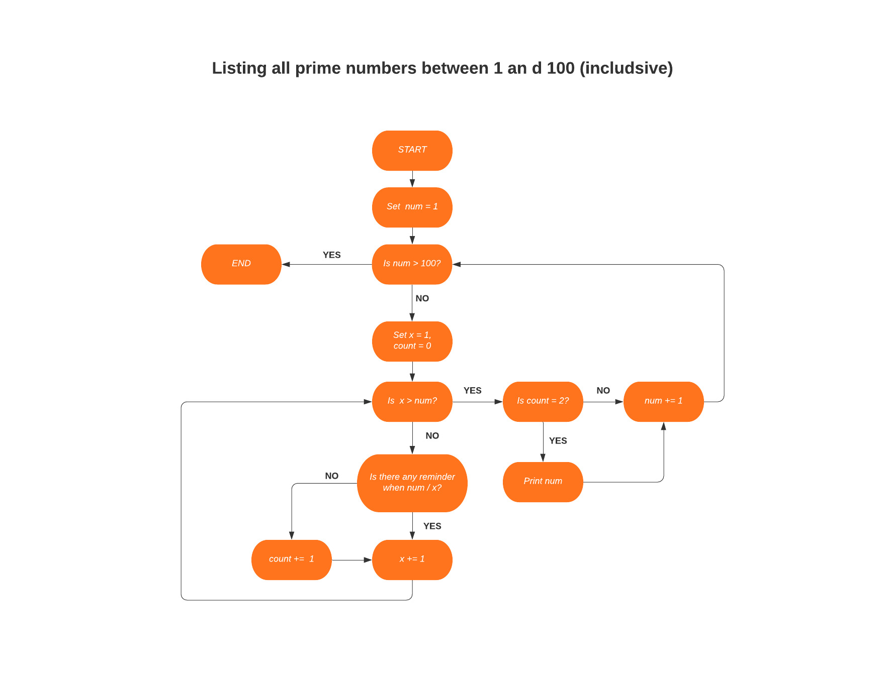

# **Workbook - Tan Na Lam - CAB022106**

## **Q1**
### **World Wide Web** 
Sim Tim Berners-Lee, a British computer scientist invented World Wide Web (WWW) in 1989. After graduating from Oxford University, Tim worked as a software engineer at CERN, a large particle physics lab near Geneva, Switzerland, where more than 17,000 scientists from over 100 countries came to use its accelerators. During his time there, he noticed the scientists were having difficulty sharing information. Because different information was stored in different computers, they need to log onto different computers to get them. Sometimes they even need to learn different programs to use different computers. It was problematic and time-consuming. At that time, millions of computers were already being connected through the fast-developing internet. Tim thought they could utilize a mighty and user-friendly global information system by emerging technologies of computers, data networks, and hypertext to share information. In March 1989, Tim wrote his first proposal called “Information Management: A Proposal” and his second proposal in May 1990. By October 1990, Tim had written 3 fundamental technologies that remain the foundation of today’s web: HTML (Hypertext Markup Language), URI (Uniform Resource Identifier), and HTTP (Hypertext Transfer Protocol). He wrote WorldWideWeb.app (later renamed Nexus) which was the first web page editor/ browser and httpd which was the first web server and by the end of 1990, the first web page was online! At first, people outside of CERN would need an invitation to join and use. But Tim discerned to unleash the true potential of WWW, anyone from anywhere should be able to use it for free and without asking for permission, so he suggested the idea to CERN, and on 30 April 1993, CERN put the WWW software in the public domain, later make the underlying code available for free perpetually.

### **ERWISE**
Erwise is the world’s first graphical point and click browser, written by Kim Nyberg, Kari Sydänmaanlakka, Teemu Rantanen and Kati Borgers, four Finnish students at Helsinki Technical University in 1991, completed and released on the 15th April 1992. It was written for Unix X Window System. The idea of creating a graphical web browser was brought by Tim Berners-Lee who placed requests around the world for a graphical browser as he thought it would make the web more user-friendly. Robert Cailliau, a colleague of Tim visited the university in 1991, those four students were very impressed on meeting him and decided to develop a web browser for them. Their instructor Ari Lemmke supervised them the whole time and named the browser “Erwise”, it comes from the English word “otherwise” as he wanted to name it “something else”. Erwise has heaps of features, includes:
<ul>
    <li>Use multi-font text</li>
    <li>Links are underlined, the user needs to double click to visit the links</li>
    <li>A new window would be open with the linked page when the user clicks on a hyperlink</li>
    <li>Support multiple window operations, but the user can opt for single-window mode</li>
    <li>Able to open a local file</li>
</ul>
Unfortunately, due to the deep economic depression in Finland at that time, the students couldn’t gather enough funding to make it a business. In contrast, Mosaic which was released a year after Erwise, was based in Silicon Valley and was able to attract abundant funds to initiate the web revolution. And so Mosaic became the mother of all graphical web browsers. Tim tried to continue to work on Erwise but couldn’t have decent progress as most of the documentations was in Finnish.

### **Dial-up internet access**
A predecessor to dial-up Internet access was invented by Tom Truscott and Steve Bellovin, both were graduates of Duke University in 1979. It was called USENET. USENET was a UNIX-based system that used a modem and a telephone line to connect to the Internet. The phone line is used to dial the number of an ISP (Internet Service Provider) by the modem which then links up to an internet connection. Because the phone line will be occupied the whole time so the user won't be able to use the telephone when they use the internet. Dial-up needs time to set up a telephone connection (times vary, depends on the location) and the speed is so slow compare to modern internet speeds. It can have the fastest speed of 56 kbps but normally it will be at 40-50 kbps. The connection speeds can be hugely affected by the phone line noise and the quality of the modem. Sprint in US and Pipex in UK was the first to provide dial-up Internet service commercially in 1992. Since then numerous other companies have hopped on the train to provide dial-up internet services such as AOL and NetZero. Although dial-up internet has been replaced with newer technologies such as cable, DSL, even NBN nowadays, we still need to appreciate the improvement and accessibility of technology and the internet it brings us.

### **WiFi**
WiFi, shorts for wireless fidelity. It is a wireless networking technology that allows different devices to communicate over a wireless signal. Vic Hayes, who has been called the "father of WiFi" established 802.11 standards in 1997 for broadcasting a WiFi signal. This lead to the formation of IEEE802.11, which outlined a set of standards that interpreted communication for WLANS (wireless local area networks). In 1997, 802.11 provided up to 2Mbit/s of data transfer wirelessly between devices. Development on routers to comply with 802.11b had begun and WiFi was introduced for home use in 1999, the link speeds were increased to up to 11Mbit/s as well. WiFi runs mainly at 2.4GHz(802.11b) and 5GHz(802.11a) on electromagnetic waves to communicate data. 2.4GHz has been a popular choice for many years as it worked with most deceives and was cheaper than 5GHz. The performance continues to improve and nowadays WiFi has been evolved to WiFi 6 which was just released in 2020. It has a faster connectivity and linkup speeds up to 9.6GBPs. 

### **Internet Relay Chat (IRC)**
Internet Relay Chat (IRC) is a text-based chat system. It allows any number of participants to start a discussion. IRC was invented by Jarkko Oikarinen in 1988 at the University of OIulu, Finland. It was intended to replace a program called MUT (MultiUser Talk) on bulletin board system(BBS) called OuluBox. He wanted to improve the BBS software and added some new features such as allow news in USENET style, real time discussions and similar BBS features. The first IRC network was running on tolsun.oulu.fi. which was just a single server. Jyrki Kuoppala, Jarkko's friend installed a server straight after the university agreed to release the IRC code so it could be run outside of Oulu and this became the first "IRC network". As the number of users increased quite quickly, so Jarkko asked his friends at other universities to start running IRC servers to spread the load. IRC had expended across the Internet in November 1988. In mid-1989, there were already around 40 servers worldwide and it reached 12 average users on 38 servers in July 1990.

## **Q2**
### **Packet**
A network packet is a small segment of a larger message. Data sent over Transmission Control Protocol/ Internet Protocol (TCP/IP) is divided into packets. Normally in a size that is about 1.5KB for Ethernet and 64KB for IP payloads. These packets will then recombine by the computer. It is fine to send files or data over the Internet without being divided into packets, but because one computer can only send data to another computer one time at a time, so if the files or data is big, it will take a long time to send over and occupy the whole line, no other computer can use the same line to send information, it has to wait for the previous one finish then it can proceed. It is inefficient to send information like this, so the Internet is using the “packet switching” approach. This allows networking equipment to process packets separately from each other. Also allows the packets to use different network paths to get to the same destination, as long as they arrive at the destination. This approach allows billions of devices to interchange information at the same time thus minimize the times and cost of data transfer.

### **IP address (IPv4 and IPv6)**
IP (Internet Protocol) is a unique address to identify a device on the network. The IP addresses allow devices to send and receive information on a local network or over the internet. Most IP addresses only contain numbers, but letters have been added recently due to internet usage growth. There are 4 categories of IP addresses are public, private, static and dynamic.
IPv4 is the original internet protocol that developed in 1983. It is a 32-bit numeric address, separated by a dot(.) and can store more than 4 billion addresses. It is the primary Internet protocol and conveys 94% of the internet traffic.     
IPv6 is the most recent protocol that was launched in 1998 to satisfy the need for more internet addresses and is also called IPng (Internet Protocol next generation). It is a 128-bit alphanumeric address, separated by a colon(:), also contains hexadecimal. It can store 340 trillion trillion trillion addresses which are more than enough for many many years.

### **Routers and routing**
Routers are devices that used to tie multiple networks together and performs as a dispatcher. They examine the data receive from a network and alter the way on the packaging, then choose the best route to transfer data packets to a destination. Routers can solve segmentation problems that can be found in LANS and can also serve as connection points between sub-networks in WAN.
Routing is the procedure of sending the packets from a device of one network to another device of some other network and is accomplished by routers. The process uses routing tables to find the path for a packet base on the IP address and other information from the table, then send the packet to the correct destination or network.

### **Domains and DNS**
A domain is the address of the website, people can type that in the browser URL bar to go to the website. But under the hood, computers only communicate with others with numbers, so here comes DNS (Domain Name System), it will convert the easy remember domain names into Internet Protocol (IP) addresses so they are readable to computers. When I type in a domain name in the web browser, it will send a request to a global network of servers. These servers will search for the name servers that are linked with the domain, and send the request to those name servers which are managed by my hosting company. My hosting company will then send those requests to the computer where the website is stored and that is called a web server. The web server will now get the web page and all information linked with it, then send these back to the browser. With DNS, we don’t have to remember every IP address to visit the websites, we can just use the human readable domain name instead, so much easier.

## **Q3**
### **TCP**
TCP (Transmission Control Protocol), is a communication standard that lets application programs and computing devices interchange information over an IP network, designed to send data and messages across the internet without fail. It provides an authentic, ordered and error-checked communication system. As TCP is always used on top of IP, this internet protocol is also referred to TCP/IP. A three-way handshake connection between a server and a client needs to be established first. Before the communication begins, both the device and the server must be synchronized, and packets need to be acknowledged. This guarantees accuracy and correctness during the process of transmitting data. The connection between a source and its destination will remain live until the transmission is finished. TCP will divide large amounts of data into smaller parts, numbers and reassembles the packets, then send them to other devices on the network.
TCP/IP protocol supplies a standard way for clients and serves to trade data and it enables systems to communicate even if they are not using the same type of network hardware. It also provides reliable transmission of data with error checking and correction and message acknowledgment for client and server communication.

### **HTTP and HTTPS**


### **web browsers(requests, rendering and developer tools**

## **Q10**
Data types represent different types of data. In Ruby, they are implemented as classes as Ruby is an Object-Oriented language. data types in Ruby include string, numbers, boolean, arrays, hashes and symbols.

### **Strings**
A string is made up of a group of characters that represent a word or a sentence. They are defined by enclosing with single ('string') or double ("string") quotes. In Ruby, it prefers a single quote on a string when we are not using string interpolation or special symbols. If the string includes a single quote and you also want to enclose it with a single quote, you need to put an escape character (\) before the single quote in the string. Alternatively, you can enclose the string with a double quote.

```ruby
puts "String Data Type"
puts 'String Data Type'
puts 'I\'m a string'

# output:
# String Data Type
# String Data Type
# I'm a string
```

### **Numbers**
A Number is a series of digits with a dot as a decimal mark. There are two main kinds of numbers in Ruby: integers and floats. Integers are whole numbers while floats are fractions in decimal format.
```ruby
# Integers
age = 32

# Floats
distance = 10.55
```

### **Boolean**
Boolean can only has 2 possible values which is true and false and these are returned when two values are compared. 
```ruby
apple = 3
orange = 5

if apple > orange
	puts "Apple is more expensive than orange"
elsif apple == orange
	puts "Apple is same price as orange"
else
	puts "Apple is cheaper then orange"
end

# output: Apple is cheaper then orange
```

### **Arrays**
An array store a list of data that can contain different types of data. Data are separated by comma in between them and are enclosed with a a pair of square brackets. The first element of the array has an index of 0.
```ruby
my_arr = ["coffee", "milk", 0.31, 50, "hello world"]
puts my_arr.index("milk")

# output: 1
```

### **Hashes**
A hash is a collection of key-value pairs. In Ruby, it uses ⇒ to assign a value to a key. Each pair of key-value is separated by comma and all pairs are enclosed with a pair of curly braces. 
```ruby
cuisine = {
	"Sushi" => "Japan", 
	"Curry" => "India", 
	"Congee" => "China"
}
```

### **Symbols**
A symbol is a lighter form of strings that is preceded by a colon (:). It use less computer memory compare to a string and have a better performance.
```ruby
cuisine = {
	Sushi: "Japan", 
	Curry: "India", 
	Congee: "China"
}
```

## **Q12**
1. We want to prompt user for input but there is no question has been asked so the user will not have idea what they should type. I will add below to the beginning of the codes. 

```ruby
    print “We can convert Celsius to Fahrenheit for you, please enter a Celsius degree.”
```

2. User input will come with a newline character “\n” at the end as user use enter to confirm the input. We don’t want this as we are going to do some calculate with the input so 
I will add .chomp after gets to remove “\n”. Also input from user will always be a string, we will need to convert the input to integer (.to_s) or float (.to_f) depends how accurate we want then we can do calculate with it. I will go with float this time.

```ruby
    Celsius = gets.chomp.to_f
```

3. The code works fine as it is but they are a bit too long which defy the basic principle: dry code. Instead of using 3 lines of codes to print out the output. I will use string interpolation. 

```ruby
    puts “The result is: #{fahrenheit}.”
```

### **Amended code**
```ruby
    print "We can convert Celsius to Fahrenheit for you, please enter a Celsius degree: "
    celsius = gets.chomp.to_f
    fahrenheit = (celsius * 9 / 5) + 32
    puts "The result is #{fahrenheit}"
```

## **Q13**
```ruby
arr = [5, 22, 29, 39, 19, 51, 78, 96, 84]

arr.each_with_index do |num, index|
		# As we only want to run the loop up till the second last so it is arr.size - 2
    if index <= arr.size - 2 && arr[index] > arr[index + 1]
        # Store the value of arr[index] into variable x so I can assign it to arr[index + 1]
        x = arr[index] 
        arr[index] = arr[index + 1]
        arr[index + 1] = x
        # Break the program as the aim is only to swap the first 2 elements that are out of order
        break
    end
end
```

## **Q14**


### **Pseudocode**
```
Start
Set variables num = 1
Repeat below until num = 100
	set variables: x = 1, count = 0
	Repeat below until x = num
		If there is no reminder when num divide by x, increment count by 1
		increment x by 1
	If count == 2 , print num
	increment num by 1
End
```

## **Q15**

```ruby
if raining == true
    puts temperature < 15 ? "It's wet and cold" : "It's warm and raining"
else
    puts temperature < 15 ? "It's not raining but cold" : "It's warm but not raining"
end
```

## **Q16**
```ruby
skills = {
  Python: 1,
  Ruby: 2,
  Bash: 4,
  Git: 8,
  HTML: 16,
  TDD: 32,
  CSS: 64,
  JavaScript: 128
}

print "Please input your skills(Please seperate your skills with comma): "
# Convert user input into an array
user_skills = gets.chomp.downcase.gsub(/\s+/, "").split(',')

score = 0
skills_missing = []
skills.each do |key, val|
  if user_skills.include? key.to_s.downcase
    score += val
  else
    skills_missing.push(key)
  end
end

puts "Your overall coding skill score is #{score}."

puts "Skills you may want to learn and how they may improve your scores: "
if skills_missing.empty?
  puts "None, you are awesome!"
else
  skills_missing.each do |skill|
    puts "#{skill}: #{skills[skill]}"
  end
end

```
