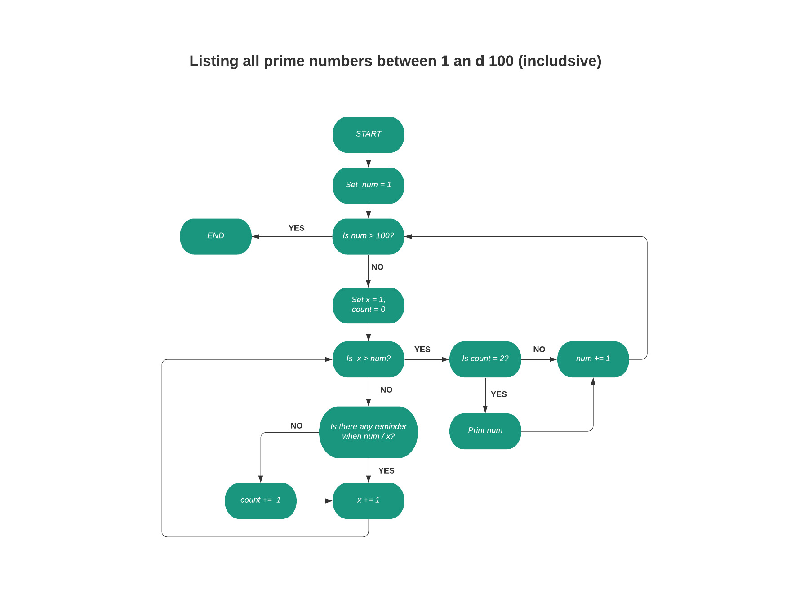

# **Workbook - Tan Na Lam - CAB022106**

## **Q1**
### **World Wide Web**
Sim Tim Berners-Lee, a British computer scientist invented World Wide Web (WWW) in 1989. After graduating from Oxford University, Tim worked as a software engineer at CERN, a large particle physics lab near Geneva, Switzerland, where more than 17,000 scientists from over 100 countries came to use its accelerators. During his time there, he noticed the scientists were having difficulty sharing information. Because different information was stored in different computers, they need to log onto different computers to get them. Sometimes they even need to learn different programs to use different computers. It was problematic and time-consuming. At that time, millions of computers were already being connected through the fast-developing internet. Tim thought they could utilize a mighty and user-friendly global information system by emerging technologies of computers, data networks, and hypertext to share information. In March 1989, Tim wrote his first proposal called “Information Management: A Proposal” and his second proposal in May 1990. By October 1990, Tim had written 3 fundamental technologies that remain the foundation of today’s web: HTML (Hypertext Markup Language), URI (Uniform Resource Identifier), and HTTP (Hypertext Transfer Protocol). He wrote WorldWideWeb.app (later renamed Nexus) which was the first web page editor/ browser and httpd which was the first web server, by the end of 1990, the first web page was online! At first, people outside of CERN would need an invitation to join and use. But Tim discerned to unleash the true potential of WWW, anyone from anywhere should be able to use it for free and without asking for permission, so he suggested the idea to CERN, and on 30 April 1993, CERN put the WWW software in the public domain, later make the underlying code available for free perpetually.

### **ERWISE**
Erwise is the world’s first graphical point and click browser, written by Kim Nyberg, Kari Sydänmaanlakka, Teemu Rantanen and Kati Borgers, four Finnish students at Helsinki Technical University in 1991, completed and released on the 15th April 1992. It was written for Unix X Window System. The idea of creating a graphical web browser was brought by Tim Berners-Lee , who placed requests around the world for a graphical browser as he thought it would make the web more user-friendly. Robert Cailliau, a colleague of Tim visited the university in 1991, those four students were very impressed on meeting him and decided to develop a web browser for them. Their instructor Ari Lemmke supervised them the whole time and named the browser “Erwise”, it comes from the English word “otherwise” as he wanted to name it “something else”. Erwise has heaps of features, includes:
<ul>
    <li>Use multi-font text</li>
    <li>Links are underlined, the user needs to double click to visit the links</li>
    <li>A new window would be open with the linked page when the user clicks on a hyperlink</li>
    <li>Support multiple window operations, but the user can opt for single-window mode</li>
    <li>Able to open a local file</li>
</ul>
Unfortunately, due to the deep economic depression in Finland at that time, the students couldn’t gather enough funding to make it a business. In contrast, Mosaic which was released a year after Erwise, was based in Silicon Valley and was able to attract abundant funds to initiate the web revolution. And so Mosaic became the mother of all graphical web browsers. Tim tried to continue to work on Erwise but couldn’t have decent progress as most of the documentations was in Finnish.

### **Dial-up internet access**
A predecessor to dial-up Internet access was invented by Tom Truscott and Steve Bellovin, both were graduates of Duke University in 1979. It was called USENET. USENET was a UNIX-based system that used a modem and a telephone line to connect to the Internet. The phone line is used to dial the number of an ISP (Internet Service Provider) by the modem which then links up to an internet connection. Because the phone line will be occupied the whole time so the user won't be able to use the telephone when they use the internet. Dial-up needs time to set up a telephone connection (times can be vary, depends on the location) and the speed is so slow compare to modern internet speeds. It can reach the fastest speed of 56 kbps but normally it will be at 40-50 kbps. The connection speeds can be hugely affected by the phone line noise and the quality of the modem. Sprint in US and Pipex in UK was the first to provide dial-up Internet service commercially in 1992. Since then numerous other companies have hopped on the train to provide dial-up internet services such as AOL and NetZero. Although dial-up internet has been mostly replaced with newer technologies such as cable, DSL, even NBN nowadays, we still need to appreciate the improvement and accessibility of technology and the internet it brings us.

### **WiFi**
WiFi, shorts for wireless fidelity. It is a wireless networking technology that allows different devices to communicate over a wireless signal. Vic Hayes, who has been called the "father of WiFi" established 802.11 standards in 1997 for broadcasting a WiFi signal. This lead to the formation of IEEE802.11, which outlined a set of standards that interpreted communication for WLANS (wireless local area networks). In 1997, 802.11 provided up to 2Mbit/s of data transfer wirelessly between devices. Development on routers to comply with 802.11b had begun and WiFi was introduced for home use in 1999, the link speeds were increased to up to 11Mbit/s as well. WiFi runs mainly at 2.4GHz(802.11b) and 5GHz(802.11a) on electromagnetic waves to communicate data. 2.4GHz has been a popular choice for many years as it worked with most deceives and is cheaper than 5GHz. The performance continues to improve and nowadays WiFi has been evolved to WiFi 6 which was just released in 2020. It has a faster connectivity and linkup speeds up to 9.6GBPs. 

### **Internet Relay Chat (IRC)**
Internet Relay Chat (IRC) is a text-based chat system. It allows any number of participants to start a discussion. IRC was invented by Jarkko Oikarinen in 1988 at the University of OIulu, Finland. It was intended to replace a program called MUT (MultiUser Talk) on bulletin board system(BBS) called OuluBox. He wanted to improve the BBS software and added some new features such as allow news in USENET style, real time discussions and similar BBS features. The first IRC network was running on tolsun.oulu.fi. which was just a single server. Jyrki Kuoppala, Jarkko's friend installed a server straight after the university agreed to release the IRC code so it could be run outside of Oulu, and this became the first "IRC network". As the number of users increased quite quickly, Jarkko asked his friends at other universities to start running IRC servers to spread the load. IRC had expended across the Internet in November 1988. In mid-1989, there were around 40 servers worldwide and it reached 12 average users on 38 servers in July 1990.

## **Q2**
### **Packets**
A network packet is a small segment of a larger message. Data sent over Transmission Control Protocol/ Internet Protocol (TCP/IP) is divided into packets. Normally in a size that is about 1.5KB for Ethernet and 64KB for IP payloads. These packets will then recombine by the computer. It is fine to send files or data over the Internet without being divided into packets, but because one computer can only send data to another computer one at a time, if the files or data is big, it will take a long time to send over and occupy the whole line. No other computer can use the same line to send information, it has to wait for the previous one finish then it can proceed. It is inefficient to send information like this, so the Internet is using the “packet switching” approach. This allows networking equipment to process packets separately from each other. Also allows the packets to use different network paths to get to the same destination, as long as they arrive at the destination. This approach optimize the channel capacity available in the networks, allow billions of devices to interchange information at the same time, , and minimize the times and cost of data transfer.

### **IP address (IPv4 and IPv6)**
IP (Internet Protocol) is a unique address to identify a device on the network. The IP addresses allow devices to send and receive information on a local network or over the internet. Most IP addresses only contain numbers, but letters have been added recently due to internet usage growth. There are 4 categories of IP addresses are public, private, static and dynamic.
<br/><br/>
IPv4 is the original internet protocol that developed in 1983. It is a 32-bit numeric address, separated by a dot(.) and can store more than 4 billion addresses. It is the primary Internet protocol and conveys 94% of the internet traffic.
<br/><br/>
IPv6 is the most recent protocol that was launched in 1998 to satisfy the need for more internet addresses and is also called IPng (Internet Protocol next generation). It is a 128-bit alphanumeric address, separated by a colon(:), also contains hexadecimal. It can store 340 trillion trillion trillion addresses which are more than enough for many many years.
<br/><br/>
The IP address is important in TCP networking. For computers and networking devices to communicate with each other, they need a way to distinguish different computers and routers. IP addresses can be used for this purpose so information can be sent between different devices on a network.

### **Routers and routing**
Routers are devices that used to tie multiple networks together and performs as a dispatcher. They examine the data receive from a network and alter the way on the packaging, then choose the best route to transfer data packets to a destination. Routers can solve segmentation problems that can be found in LANS and can also serve as connection points between sub-networks in WAN.
<br/><br/>
Routing is the procedure of sending the packets from a device of one network to another device of some other network and is accomplished by routers. The process uses routing tables to find the path for a packet base on the IP address and other information from the table, then send the packet to the correct destination or network.
<br/></br>
Rounter and routing come hands in hands with IP packets, without them we can't connect multiple devices to the internet and exchange packets to each other.


### **Domains and DNS**
A domain is the address of the website, people can type that in the browser URL bar to go to the website. But under the hood, computers only communicate with others with numbers, so here comes DNS (Domain Name System). It will convert the easy remember domain names into Internet Protocol (IP) addresses so they are readable to computers. When I type in a domain name in the web browser, it will send a request to a global network of servers. These servers will search for the name servers that are linked with the domain, and send the request to those name servers which are managed by my hosting company. My hosting company will then send those requests to the computer where the website is stored and that is called a web server. The web server will now get the web page and all information linked with it, then send these back to the browser. 
<br/><br/>
With DNS, we don’t have to remember every IP address to visit the websites, we can just use the human readable domain name instead, so much easier.

## **Q3**
### **TCP**
TCP (Transmission Control Protocol), is a communication standard that lets application programs and computing devices interchange information over an IP network, designed to send data and messages across the internet without fail. It provides an authentic, ordered and error-checked communication system. As TCP is always used on top of IP, this internet protocol is also referred to TCP/IP. A three-way handshake connection between a server and a client needs to be established first. Before the communication begins, both the device and the server must be synchronized, and packets need to be acknowledged. This guarantees accuracy and correctness during the process of transmitting data. The connection between a source and its destination will remain live until the transmission is finished. TCP will divide large amounts of data into smaller parts, numbers and reassembles the packets, then send them to other devices on the network.
<br/><br/>
TCP/IP protocol supplies a standard way for clients and serves to trade data, and it enables systems to communicate even if they are not using the same type of network hardware. It also provides reliable transmission of data with error checking and correction and message acknowledgment for client and server communication.

### **HTTP and HTTPS**
#### **HTTP**
HTTP stands for Hypertext Transfer Protocol. It is a widely used Client-server protocol that enables clients to request web pages from web servers on the internet. When a user wants to access a webpage, the client (usually a web browser) will send an HTTP request message to the webserver, and the webserver responds with the requested web page. Clients and web servers communicate with each other with a request-response method: clients send out HTTP requests using GET method, and servers respond with HTTP Responses with a status message (if the request is successful, the status message will be 200) and the requested resource. For example, the user wants to access http://www.google.com so type in the URL in the browser and the browser sends out a request. The web server that hosts http://www.google.com receives the request and replies with the content of the webpage plus a status message. Web servers use TCP Port 80 by default. If the port is not specified in a URL, browsers will use this port to send out the HTTP Request. It is the same result when requesting http://www.google.com and http://www.google.com:80. 
<br/><br/>
HTTP is an independent platform so it can be used on cross-platform porting. HTTP pages can be accessed speedily as they are stored on the computers and the internet caches. HTTP can even be used over firewalls, so it works on global applications. However, it is not encrypted so is vulnerable to attackers who want to gain access to website database and sensitive information.  

#### **HTTPS**
HTTPS stands for Hypertext Transfer Protocol Secure. This protocol enables encrypted HTTP data to be transferred over a secure connection between a client and a server, so only the client can decrypt the information from the server. HTTPS uses Transport Layer Security (TLS) or Secure Sockets Layer (SSL) to secure the connections and ensures data security over the network. We can tell if the website is HTTPS by looking at the URL, if it begins with HTTPS that means the website is using the secure protocol. Also, there should be a lock logo next to the URL as well (depends on different browsers). HTTPS is mainly used on websites that deal with money transactions or transfer sensitive user’s data, such as online banking, email service, etc. Web servers use TCP Port 443 for HTTPS by default. If the port is not specified in a URL, browsers will use this port to send out the HTTPS Request. It is the same result when requesting http://www.gmail.com and http://www.gmail.com:443. 
<br/><br/>
Nowadays, a lot of traffic on the internet is unencrypted, HTTPS protects users from attackers who are eavesdropping, forging information, and tampering with data if they have a chance. It helps to maintain the privacy and integrity of data and validate the authentication of websites.

### **web browsers(requests, rendering and developer tools)**
**Web browser** (usually shortened to browser) is application software that allows a user to access web pages. They are used for displaying and accessing websites on the internet, and other contents that are created with Hypertext Markup Language (HTML) or Extensible Markup Language (XML). Browsers are widely used on a range of devices - desktops, laptops, tablets and smartphones. When the user inputs a URL into the browser, the browser will fetch necessary content from a web server and display on the user's device with the help of the browser's rendering engine. This includes image and video formats that are supported by the browser. Web pages always have hyperlinks to other pages or resources and each hyperlink contains a URL. When the user clicks the link, the browser will navigate to the new page or resource and again display corresponding content on the device. Most browsers use their internal cache to improve loading times by storing items that need to be downloaded from server time over time.
<br/><br/>
**Browser engine**, (aka rendering engine or layout engine) is a core component of every web browser. It transforms HTML and XML documents, which may contain texts, links, references to images and other resources of a web page such as Cascading Style Sheets (CSS) and JavaScript into an interactive visual pages on a user's device. Different browsers have their rendering engines and they may vary for different browser versions as well. For example, Mozilla Firefox uses Gecko and Chrome for iOS and Safari uses WebKit.
<br/><br/>
Developers can use **developer tools** (often called devtools) on a range of things, such as inspecting HTML, CSS, JavaScript, DOM and other components that are handled by the web browser. Devtools are great for testing and debugging. Most popular browsers such as Firefox, Google Chrome, Safari, Internet Explorer, etc have their built-in devtools with many add ons to be found in their plugin download stores.
<br/><br/>
Modern web browsers allow users to access millions and millions of web pages in a quick, easy fashion. We simply put the URL of the website in the browser and it will handle the request and response at the back. Also with the help of the browser engine, an interactive visual beautiful website will display in front of us within seconds. Devtools in the browsers help developers to test and debug very easily. We can view information like network usage, performance time, webpage assets and such.

## **Q4**
Data structures is a particular way to organize and access data. 
### **Array**
An array is an ordered, integer-indexed (starts at 0) collection of any objects, it can hold a string, integer, float, hash, symbol and other array objects. It uses a contiguous block of memory to store the objects without any gap between them. 
<br/><br/>
We can create a new array with with or without objects in it, use comma (,) to separate the objects and enclosed them with square brackets [ ].
```ruby
arr1 = []
arr2 = ["orange", 123, 10.5, true, {HTML: 16}]
```
Or by calling the new method with arguments to create a new array. We can define the initial size and set a default object of the array.
```ruby
Array.new(5, "new")

# => ["new", "new", "new", "new", "new"]
```
The easiest way to access the elements in an array is by utilizing the index:
```ruby
arr = ["orange", "apple", "coffee"]
arr[0]  # => orange
arr[1]  # => apple
arr[2]  # => coffee
```
But there are also lots of methods that can be used to retrieve the elements:
```ruby
arr = ["orange", "apple", "coffee", "tomato", "lettuce"]
arr.first  # => orange
arr.last(2) # => tomato, lettuce
arr.slice(3) # => tomato
```
With all the built-in methods in Ruby, they allow us to add, remove, access and loop over the elements in an array easily. Without array, we need more variables to achieve the same result, our codes won't be DRY. It can also help to collect items and gather results from running a loop.
```ruby
arr = [10, 56, 28, 39, 88, 1, 4, 32, 21, 40]
num_list = []

arr.each do |num|
    if num > 15
        num_list.push(num)
    end
end

print num_list

# => [56, 28, 39, 88, 32, 21, 40]
```

### **Hashes**
A Hash is a collection of key-value pairs. They are similar to an array but unlike array uses integers as its index, we can use any object type as the key likes a string, integer, symbol etc. We can create a Hash by calling the new method:
```ruby
h = Hash.new
```
Or create a Hash with initial entries. A Hash is enclosed by curly braces { }, inside can be as many key-value pairs as you like and they are separated by a comma. The old syntax is using the "hash rocket" (⇒) in the key-value pair:
```ruby
h = { "author" => "J.K. Rowling", "books" => "Harry Potter Series"}
```
We can also use a symbol for a Hash key, it is the conventional way as using a symbol instead of a string is more efficient in memory.
```ruby
h = { authro: "J.K. Rowling", books: "Harry Potter Series", genre: "fantasy"}

puts h[:genre]

# => fantasy
```
We can use Hash to count characters in a string as well:
```ruby
str = "aakkllsaagh"
count = {}
count.default = 0
str.chars.each do |letter|
    count[letter] += 1
end

p count

# => {"a"=>4, "k"=>2, "l"=>2, "s"=>1, "g"=>1, "h"=>1}
```

### **Stack**
A stack is like a stack of plates, we add new plates on top of the plates that are already there. And when we remove a plate, we take it from the top of the stack. In computer science, we say push instead of add, pop instead of remove. Often we can hear LIFO (Last In First Out) regards to stack and because of that there is no indexing in stack. Here's a simple stack implementation in Ruby:
```ruby
class Stack
    attr_reader :items

    def initialize
        @items = []
    end

    def push(item)
        @items.push(item)
    end

    def pop
        @items.pop
    end

    def size
        puts @items.length
     end

    def to_s
        @items
    end
    
end
```
We create a new Stack object by calling the new method:
```ruby
stack = Stack.new
```
We then use the push method to add an item to the stack and use pop method to remove an item from the stack. To get the number of items in the stack, we use the size method:
```ruby
stack.push("apple")
# => @items = ["apple"]
stack.push("orange")
# => @items = ["apple", "orange"]
stack.pop
# => @items = ["apple"]
stack.size
# => 2
```
We can use a stack to keep track of work left to do and leaving the most recent on top. Please see the below example. I have an empty array to keep my to-do tasks and a class variable count to keep track of how many tasks are in total after I add or remove tasks.
```ruby
class Stack
    attr_reader :to_do

    @@count = 0

    def self.count
        @@count
    end

    def initialize
        @to_do = []
    end

    def push(item)
        @to_do.push(item)
        self.class.count += 1
    end

    def pop
        @to_do.pop
        self.class.count -= 1
    end

    def self.count=(value)
        @@count = value
    end

    def to_s
        puts "You have #{@@count} items left on your to-do list, including #{@to_do.join(", ")}."
    end
end

to_do = Stack.new
to_do.push("finish workbook")
to_do.push("cook dinner")
to_do.push("read Harry Potter")
to_do.to_s 
# => You have 3 items left on your to-do list, including finish workbook, cook dinner, read Harry Potter.
to_do.pop
to_do.to_s
# => You have 2 items left on your to-do list, including finish workbook, cook dinner.
```

## **Q5**
Interpreters and compilers are both used to translate a program from programming language to machine language. Programs are written in a high-level language (language that is understandable by humans) are either executed directly by some sort of interpreter or converted into machine code by a compiler so the CPU can execute the codes. 

### **Interpreters**
An interpreter is a program that directly executes instructions written in a programming language without converting them to machine code before the program run. Instead, each statement will be converted into machine code line by line when the program is running. There is no linking of files or generate any machine code, unlike the compiler. As an interpreter will not generate any output program or object code, it needs to evaluate the souce code every time during execution. But because it doesn’t generate any output, the interpreter is good for memory efficiency. It uses less time to analyze the source code as unlike the compiler, it reads line by line when the program is running, thus the overall execution is comparatively slower than a compiler. Since the nature of reading statements line by line, if we have any errors in the program, they will be displayed the same way. We must correct the error before the interpreter interprets the next line of code. Unlike compiled programs, interpreted programs can only run on the computers that have the respective interpreters, so if users don’t have the corresponding interpreter, they will need to download one to run the program. Interpreted programming languages include Python, Ruby, Perl, PHP, etc. Here are two types of interpreters: 
#### **Bytecode Interpreter**
A bytecode program is executed by parsing and executing the instructions directly. Each instruction starts with a byte so bytecode interpreters have up to 256 instructions. Bytecode interpreter is very portable. Dynamic translators or JIT (just-in-time) compilers translate bytecode into machine code at runtime. 

#### **Threaded code interpreter**
A threaded code interpreter uses pointers instead of bytes for the instruction. Each instruction is a word that directs to a function or an instruction sequence. The number of instructions is restricted by the available address and memory space. 
 
### **Compilers**
Compiler converts an entire program into machine code (AKA binary code) before program run then executed directly by the computer hardware. The compiler starts with creating the program, the parse all language statement to check the correctness. If there is any error, it will display all errors and warnings all at once, and we must fix them beforehand if we want to compile successfully. After fixing all errors, the compilers will convert the entire source code to machine code. It links different code files into a runnable program then runs the program. Once the program has complied, its source code is not useful for running the code unless you make any change on the program, this is different from the interpreter as it relies on source code. Since the compiler will generate object code that requires linking later, it needs more memory compared to an interpreter. Although it takes a large amount of time to analyze the source code  (because it converts the entire program) but the overall execution time is comparatively faster than interpreters. Compiled programming languages include C, C++, C#, etc. Here are two types of compilers:
### **Cross-compiler**
A cross-compiler is capable to produce codes for different CPU or operating systems than the one on which the cross-compiler itself runs.
### **Bootstrap compiler**
A bootstrap compiler is a compiler written in the language that intends to compile (self-compiling compiler).      

## **Q6**
### **Ruby**
Ruby is designed and developed by Yukihiro “Matz” Matsumoto in 1995, inspired by his favorite languages (Perl, Smalltalk, Eiffel, Ada, and Lisp) to form a new language that focuses on simplicity and productivity. It can be used for webpages, interfacing with databases and generating dynamic content. Ruby is an object-oriented programming language (OOP) that uses classes as blueprints for objects. In Ruby, everything is an object. Strings, numbers, and Boolean are all objects. The syntax is like human language, easy to read and write, also very clean: no need to put semicolons (;) at the end of each statement if we put each statement on a new line. Indentation is not needed for Ruby, but we still use it for readability. Ruby use # to start a comment on a new line or after a statement. For naming method, Ruby uses class keyword with PascalCase to define a class, and def keyword with snake_case to define a method.

#### **Pros**
Ruby is a dynamic programming language with an elegant syntax that is easy to read, write and learn. As the language focuses on simplicity and productivity and is an open-source language, it can be time and cost efficient in creating web applications. It is relatively lightweight and is portable across different platforms: Linux, Windows, Mac, iOS, Android, etc. There are heaps of gems, libraries and plugins to make software developers' life easier. It is a very mature and well-maintained language, suitable for web development, system administration, scripting and databases.

#### **Cons**
Ruby has a slower performance compared to some languages like Java, C or C++ because Ruby is an interpreted language, while Java, C and C++ are compiled languages. But base on what we use it for, it may not be something we need to worry about. Ruby is good enough on web applications but might not be a good choice for machine learning. Ruby is extremely flexible, for example we can use and, or, not instead of or &&, || and !. And there is often more than one way of doing things, developers can come up with different solutions to solve the same problem, even with unconventional ones. That means it can be hard to detect any errors and debug.

### **JavaScript**
JavaScript(JS) is designed by Brendan Eich of Netscape back in the mid-1990s. Compare to Ruby which is a class-based object-oriented language, JS is a prototype-based object-oriented language. There are no classes in JS, rather it uses the constructor function to define behaviors and reuse them by the prototype. Along the side of HTML and CSS, JS is one of the key technologies of World Wide Webs(WWW). JS converts the web page from a static page into an interactive page to improve the user experiences. Besides adding interactive on the web pages, it can also use on building web servers, developing server applications using Node.js, and on game development. Unlike Ruby, there is a set of rules on JS syntax: whitespace can impact semantics as there is a feature called automatic semicolon insertion. This feature will add semicolons automatically after certain ECMAScript statements such as variable statements, expression statements, etc. That's why proper indentation is important. JS uses var, let and const keywords pair with camelCase to declare and naming a variable.

#### **Pros**
Since JS is an interpreted language and also a client-side script, it can be run immediately within the client-side browser which minimizes the speed it takes to process, and because of the client-side aspect, it reduces the demand on servers. It is easy to learn and implement due to its simple structure. It works well with other languages and can be used on different applications. Same as Ruby, JS has loads of third-party add-ons to extend the functionality. Due to its popularity, there are numerous resources online to help us work with this language.

#### **Cons**
Although client-side is classified as one of the pros it can be a con as well. Because the JS codes are always viewable to the user, some may use them for spiteful purposes, such as using the source code without authentication, amend codes to jeopardize the security of data over the website. Because of these reasons, some people choose to disable JS. The same JS codes can be interpreted differently by different browsers. So we need to test on various platforms to ensure the codes run correctly.

## **Q7**
### **Intellectual property, copyright, and acknowledgement**
I believe developers are all creators. As a creator, we need to respect any forms of ideas, arts and works. We should recognize others spending their times and money to have a form of creation and it is disrespectful to just steal or use their works without asking permission or give the author proper attribution. It is easy to just google and copy and paste the codes to our project but to what extent? We should be really careful as we may violate some laws and we don't even know. We will need to thoroughly understand the Australia Intellectual Property Law and Copyright Act, this will give us a guideline on what can or can't do. Then we have to stick with the guideline such as ask for permission when need to use someone else works, proper attribution to the author, ensure our codes are not identical or most similar to others works. 
<br/><br/>
**Australia Intellectual Property Laws** is to support innovation and protect businesses that developing original intellectual property (IP) and other intangible assets that relate to the business such as patents, trademarks, designs and secret processes and formulae. The law outlines the below protections: patent protection, trademark protection, registering a domain name, design protection and copyright protection. The law gives the creator certain exclusive rights on their creation. Nobody can copy or reuse without the owner's permission.
<br/><br/>
**Copyright Act** is created to protect all original works in multiple fields and allows the creators to manage how to use their content. Certain forms of expression, includes text, images and music are automatically covered by Copyright Act, there is no need to register.
<br/><br/>
Under copyright law, attribution is an **acknowledgment** to the copyright holder or author of a work. When we are directly quoting portions of work which is under copyright, traditionally we need to acknowledge the author for credit. If we don't properly attribute copyright information, it may incur fines, penalties, or even lawsuits.
<br/><br/>
These all ensure developers' creations can be protected and can't be reused by someone else without permission. Likewise, with proper attribution, developers can quote or use others' work without worry about breaking the law.

### **Access to a user’s personal information** 
Lots of time, developers may need to request and collect personal information from users, especially when the websites or software are related to shopping, making reservations on services, banking, etc. It is very important we as a developer has built some strong protections to protect user’s privacy, and only collect necessary personal information or even sensitive information with individual’s consent. We can’t use the collected information for other purposes rather than the particular purpose for that was collected. And if we have collected some unsolicited information, we are meant to handle them properly. It is not just about ethical on doing this but also gives out an image to the users that they can trust our web site or software to not violate their privacy. 
<br/><br/>
**Privacy Act - Australian Privacy Principles**
<br/><br/>
**APP 3 – Collection of solicited personal information**
<br/>
An organization may only collect or request any personal information that is fairly necessary for one or more of its functions or activities. Also, an organization may only collect and request sensitive information when the individual consents to that information to be collected.
<br/>
**APP 4 – Dealing with unsolicited personal information**
<br/>
Unsolicited personal information means that information is received by an organization when they have not taken any active steps to collect. The purpose of APP 4 is to ensure the personal information that is received by an organization is under proper privacy protection, even when the organization has not solicited the information.
<br/>
**APP 6 – Use or disclosure of personal information**
<br/>
An organization can only use or disclose the personal information for their primary purpose, or a secondary purpose if there is any expectation applies. An organization may disclose personal information but not sensitive information to a related body corporate, but they can't be used for direct marketing or government-related identifiers. According to Privacy Act, sensitive information is personal information that contains information or an opinion about an individual, such as sexuality, religion or beliefs, political opinions, health, or genetic information, etc.
<br/>
**APP 11 - Security of personal information**
<br/>
An organization must takes active steps to protect personal information so they aren’t misused, interfered and lost, in addition unauthorized access, tempering or disclosure.
<br/><br/>
These principles give developers an idea of how we can request and collect personal information in a right and ethical way, what kind of personal information we can request and collect, how to handle unsolicited personal information and the importance to protect personal information. They are all listed very clear in each aspect so developers can refer easily if need to. 

### **Case study**
Amazon.com submitted a patent application for their now well-known "One-click" shopping in 1997 and has been granted the United States Patent Number 5,960,411 on September 28, 1999. "One-click" shopping is an online system that allows customers to enter their credit card details and address just once for future purchases. When they want to purchase again from the website, what they need to do is just one mouse-click to make the purchase, no need to go through the virtual shopping cart process again. Amazon filed a lawsuit in the federal district court of Seattle against Barnesandnoble.com just 23 days after the "one-click" patent was issued. Amazon advised their "Express Lane" shopping process infringed their new patent. Barnes & Noble had two purchasing options: one was the virtual shopping cart that customer can add their wanted items in, then check out when the shopping is finished. The second option was "Express Lane" which allowed registered customers to bypass the shopping cart and purchase a book with a single mouse click. Barnes & Noble uses the feature "cookies" to recognize the customers, associate their orders with corresponding credit and shipping information provided by the customers previously, which were stored in Barnes & Noble's server. On December 1, 1999, the count agreed with Amazon.com and ordered Barnes & Noble to remove the "Express Lane" shopping option from its website. Barnes & Noble appealed but the court upheld the decision, "Express Lane" was removed. Amazon's "one-click" patent expired in September 2017, although they no longer have the exclusivity of the one-click purchase, this innovation has already brought them enormous wealth.
<br/><br/>
Amazon and Barnes & Noble were using different methods to achieve the same functionality. Amazon spent hours and dollars to develop this online shopping system while Barnes & Noble used a browser feature to enable them to do the same thing. This was a US patent case, but if I brought it into Australia, it might have a different result. According to Australia Intellectual Property Laws, they focus on whether the 'substance' of the invention is technical innovation (patentable) or a business innovation (non-patentable) on the computer-implemented inventions. Technical innovation means the innovation allows the computer to perform an action that couldn't perform before, for example, the innovation is about a new method to store data more efficiently than what was known before. And business innovation they used computer's known function (cookies - help the website to keep track of user's visits and activity) and the only innovations lie inside a way of doing business. Amazon's "one-click" will fall into technical innovation as they patented on their system. Barnes & Noble's "Express Lane" used the computer's known function (cookies - help the website to keep track of user's visits and activity) instead of creating software or system by using Amazon's source codes. According to Copyright Act, it is the code is protected not the function (bypass the shopping cart process and finalize the purchase with a single mouse click). So Barnes & Noble may have a different result if it was happened in Australia as Amazon patented their system but not the idea/ function.
<br/><br/>
From this case study, some takeaways incluldes if the software is patentable, we need to go and get it patented. It is one of the ways to protect our IP. Also, we can protect our software by copyright law as well. A computer program is identified as literary work and the source code is automatically covered by Copyright Act. However copyright law is different in different countries, if we want our software to be protected globally, we need to look into the law in different countries as well.
<br/><br/>
When we are developing new software, we need to be aware of the codes that we type. As I said before Copyright Act protects the source code, not the function. It is fine to make software that has the same function as another one but if our codes have been found out are too identical or similar to them, we may infringe the copyright law.
<br/><br/>
It would be best to seek professional advice if we are ever afraid our software or product infringes any laws.

## **Q8**
Control flow is the order instructions or statements are executed or evaluated when a program is running. Control flow statement allows us to select different outcomes depending on the inputs, the result of the computation or the returned value by other methods. In Ruby, there are couple of different kinds of control flow statements.

### **if statement**
If a statement takes an expression to check if it is true. The block of codes will only be executed when the expression is true.
```ruby
if true
	print "True"
end
```

### **if/else statement**
It takes an expression to check if it is true. If the expression is true, run the block of codes, otherwise run the codes after the else keywords.
```ruby
if true
	print "True"
else
	print "False"
end
```

**Ternary operator** can be used as a shorthand version of the if/else statement. It takes three arguments: the first argument can be any expression, as long as it returns a boolean value. The second argument is the codes that will be executed when the expression returns true and the third argument is the codes that will be run when the expression returns false. The syntax looks like this: `boolean ? Execute this code if true : Execute this code if false`
```ruby
water = true

puts water ? "No need to water the plants today" : "Water the plants today"

# => No need to water the plants today
```

### **elsif statement**
This is similar to if/else statement but elsif allows us to have more than two options. 
```ruby
if true
	print "True"
elsif false
	print "False"
else
	print "This is either true or false"
end
```

### **unless statement**
This can be used when we want to evaluate if a statement is false instead of if it's true. 
```ruby
need_fuel = false

unless need_fuel
	puts "No need to get fuel"
else
	puts "Time to get some fuel"
end

# => No need to get fuel
```

We can use a shorthand if there is only a single line code and the syntax looks like this: `codes that will execute unless boolean` 
```ruby
need_fuel = false

puts "No need to get fuel" unless need_fuel
```

### **case statement**
A case statement can be used when we have multiple options. We can use elsif statement for the same situation but the case statement creates simpler, neater, easy-to-read branches. We set a variable or an expression and use the case keyword to get the variable input and use by when keyword, which is used to check for the condition. Lastly, we use else to act as a default, if none of the conditions match, the code below else will execute.
```ruby
battery = 25

case battery
when 0
	puts "You ran out of battery"
when 1..30
	puts "You need to charge your phone, battery is nearly die"
when 31..80
	puts "Your phone can last for a while"
when 81..100
	puts "Battery is almost full, no need to worry about it"
else
	puts "Error! Invalid value (#{battery})"
end

# => You need to charge your phone, battery is nearly die
```

## **Q9**
Type coercion means the process of converting values from one data type to another. For example we can use .to_s to convert an integer to a string or use .to_i to convert a string to an integer. In Ruby, there are explicitly and implicitly convention methods.
<br/><br/>
The explicit convention method will convert an object from one data type to another type to have a decent representation of the preferred type. Common ones are .to_s, .to_i, .to_a, .to_h. For instance, .to_s return a string representation of an object for display purposes.
<br/><br/>
Here’s an example on the ShoppingList class, we can use .to_s to define how we want to present the instance variables, in this case, we return them in string interpolation.
```ruby
class ShoppingList
    attr_reader :item, :quantity

    def initialize(item, quantity)
        @item = item
        @quantity = quantity 
    end

    def to_s
        "#{@quantity} #{@item}"
    end
end
```
So now we have a string representation of the ShoppingList class and can be used nicely later when we print them out.
```ruby
shopping_list = ShoppingList.new("apple", 2)

puts "I need to buy #{shopping_list}"

# => I need to buy 2 apple
```
The implicit convention method will convert an object to another data type that behaves likes the desired type and the reason it is called implicit as Ruby will call it automatically whenever it needs to. Common ones are .to_str, .to_int, .to_ary, .to_hash. For instance, Ruby use .to_str implicit convention method to concatenate strings.
<br/><br/>
Same we are using the ShoppingList class as an example. If we want to use concatenation to print out the sentence instead of string interpolation, it won’t work, it will throw a typeerror:
```ruby
shopping_list = ShoppingList.new("apple", 2)

puts "I need to buy" + shopping_list

# => no implicit conversion of ShoppingList into String (TypeError)
```
This is because ShoppingList is not an actual string object, it just presents like a string. We need to tell Ruby that it is a string-like object so we can use concatenation on it. We can do it with to_str.
```ruby
class ShoppingList
    ...

    def to_str
        "#{@quantity} #{@item}"
    end
end
```
Now when we concatenate a string to the ShoppingList object, it will return a string object.
```ruby
shopping_list = ShoppingList.new("apple", 2)

puts "I need to buy " + shopping_list

# => I need to buy 2 apple
```

## **Q10**
Data types represent different types of data. In Ruby, they are implemented as classes as Ruby is an Object-Oriented language. Data types in Ruby include string, numbers, boolean, arrays, hashes and symbols.

### **Strings**
A string is made up of a group of characters that represent a word or a sentence. They are defined by enclosing with single ('string') or double ("string") quotes. In Ruby, it prefers a single quote on a string when we are not using string interpolation or special symbols. If the string includes a single quote and you also want to enclose it with a single quote, you need to put an escape character (\) before the single quote in the string. Alternatively, you can enclose the string with a double quote.
```ruby
puts "String Data Type"
puts 'String Data Type'
puts 'I\'m a string'

# output:
# String Data Type
# String Data Type
# I'm a string
```

### **Numbers**
A Number is a series of digits with a dot as a decimal mark. There are two main kinds of numbers in Ruby: integers and floats. Integers are whole numbers while floats are fractions in decimal format.
```ruby
# Integers
age = 32

# Floats
distance = 10.55
```

### **Boolean**
Boolean can only have 2 possible values which are true and false and these are returned when two values are compared. 
```ruby
apple = 3
orange = 5

if apple > orange
	puts "Apple is more expensive than orange"
elsif apple == orange
	puts "Apple is same price as orange"
else
	puts "Apple is cheaper then orange"
end

# output: Apple is cheaper then orange
```

### **Arrays**
An array store a list of data that can contain different types of data. Data are separated by a comma in between them and are enclosed with a pair of square brackets. The first element of the array has an index of 0.
```ruby
my_arr = ["coffee", "milk", 0.31, 50, "hello world"]

puts my_arr.index("milk")

# output: 1
```

### **Hashes**
A hash is a collection of key-value pairs. In Ruby, it uses ⇒ to assign a value to a key. Each pair of key-value is separated by a comma and all pairs are enclosed with a pair of curly braces.
```ruby
cuisine = {
	"Sushi" => "Japan", 
	"Curry" => "India", 
	"Congee" => "China"
}
```

### **Symbols**
A symbol is a lighter form of a string that is preceded by a colon (:). It uses less computer memory compare to a string and has a better performance.
```ruby
cuisine = {
	Sushi: "Japan", 
	Curry: "India", 
	Congee: "China"
}
```

## **Q11**
I will assume this restaurant still has back of the house as there is no point to keep opening when there are no chefs to cook. So all the front of the house are gone, I am thinking to place a tablet at the front door for customers to place the order themselves. After payment, the tablet will assign a table number to customers so they can sit at a table that we know where. A display screen will be placed at the pick-up window where chef brings out the food, the table number will pop up on the screen when the food is ready, then the customer can go and grab the food. 
<br/><br/>
Here are the classes that I have:<br/>

I have a master class: **restaurant** and two subclasses: **staff** and **equipment to replace front of house**. Under staff, there are two subclasses which are **front of house** and **back of house**. We can dismiss the **front of house** as they are all gone. There are two subclasses under the **back of house** class: **chefs** and **dishwashers**. They are the only ones in the restaurant and keep it running. **Chefs** class contains attributes order details and if food is ready. Also has methods: receive order details from the tablets, cook the ordered food and enter table number onto the display screen when food is ready. **Dishwashers** class has attributes: if customers have left and table number. Methods include clean the table after customers have left, update the tablet with table numbers that are cleaned so it can be re-assign to new customers.
<br/><br/>
Under **equipment to replace front of house** class, there are two sub classes: **tablets for ordering** and **display screen for collection**. Firstly the **tablets for ordering** class, as all the front of the house are gone, we need something to replace them so our customer still can order food of their choice. This class has menu, prices and EFTPOS machine as the attributes. Customers can check out what food they can order, how much are they and make payment via the tablet.
<br/><br/>
Under this class is a subclass **ordering**. This includes attributes: order details, total price, paid or not paid and the designated table number. Also two methods: send the order to the back of the house after payment and assign a table number to customers. This class handles everything related to ordering.
<br/><br/>
Another subclass under **equipment to replace front of house** is **display screen for collection**. This contains attributes table number, is the food ready and is the food has been collected by customers. Pair with two methods: display table number on the screen when the food is ready and option for customers to confirm they have collected the food. This class handles everything related to food deliver from kitchen to customers. 

## **Q12**
- We want to prompt user for input but there is no question has been asked so the user have no idea what they should type. I will add below to the beginning of the codes. 

```ruby
    print “We can convert Celsius to Fahrenheit for you, please enter a Celsius degree: ”
```

- User input will come with a newline character “\n” at the end as user use enter to confirm the input. We don’t want this as we are going to do some calculation with the input so I will add .chomp after gets to remove “\n”. Also input from user will always be a string, we will need to convert the input to integer (.to_s) or float (.to_f) depends how accurate we want then we can do calculate with it. I will go with float this time.

```ruby
    Celsius = gets.chomp.to_f
```

- The code works fine as it is but they are a bit too long which defy the basic principle: dry code. Instead of using 3 lines of codes to print out the output. I will use string interpolation. 

```ruby
    puts “The result is: #{fahrenheit}.”
```

### **Amended code**
```ruby
    print "We can convert Celsius to Fahrenheit for you, please enter a Celsius degree: "
    celsius = gets.chomp.to_f
    fahrenheit = (celsius * 9 / 5) + 32
    puts "The result is #{fahrenheit}"
```

## **Q13**
```ruby
arr = [5, 22, 29, 39, 19, 51, 78, 96, 84]

arr.each_with_index do |num, index|
    # As we only want to run the loop up till the second last so it is arr.size - 2
    if index <= arr.size - 2 && arr[index] > arr[index + 1]
        # Store the value of arr[index] into variable x so I can assign it to arr[index + 1]
        x = arr[index] 
        arr[index] = arr[index + 1]
        arr[index + 1] = x
        # Break the program as the aim is only to swap the first 2 elements that are out of order
        break
    end
end
```

## **Q14**


### **Pseudocode**
```
Start
Set variables num = 1
Repeat below until num = 100
	set variables: x = 1, count = 0
	Repeat below until x = num
		If there is no reminder when num divide by x, increment count by 1
		increment x by 1
	If count == 2 , print num
	increment num by 1
End
```

## **Q15**

```ruby
if raining == true
    puts temperature < 15 ? "It's wet and cold" : "It's warm and raining"
else
    puts temperature < 15 ? "It's not raining but cold" : "It's warm but not raining"
end
```

## **Q16**
```ruby
skills = {
  Python: 1,
  Ruby: 2,
  Bash: 4,
  Git: 8,
  HTML: 16,
  TDD: 32,
  CSS: 64,
  JavaScript: 128
}

print "Please input your skills(Please seperate your skills with comma): "
# Convert user input into an array
user_skills = gets.chomp.downcase.gsub(/\s+/, "").split(',')

score = 0
skills_missing = []
skills.each do |key, val|
  if user_skills.include? key.to_s.downcase
    score += val
  else
    skills_missing.push(key)
  end
end

puts "Your overall coding skill score is #{score}."

puts "Skills you may want to learn and how they may improve your scores: "
if skills_missing.empty?
  puts "None, you are awesome!"
else
  skills_missing.each do |skill|
    puts "#{skill}: #{skills[skill]}"
  end
end

```

## **Reference**
AmberBit (2014, September 9). Ruby – the bad parts. Things we don’t enjoy about Ruby. Retrieved from
https://www.amberbit.com/blog/2014/9/9/ruby-the-bad-parts/ 

Australia Federal Register of Legislation (2021, January 28). Copyright Act 1968. Retrieved from
https://www.legislation.gov.au/Details/C2021C00044 

Australian Trade and Investment Commission (2013, July 17) Australian Intellectual Property laws. Retrieved from
https://www.austrade.gov.au/international/invest/guide-to-investing/running-a-business/understanding-australian-business-regulation/australian-intellectual-property-laws 

Bellis M. (2021, January 1). Who Created Wi-Fi, the Wireless Internet Connection? Retrieved from https://www.thoughtco.com/who-invented-wifi-1992663

Berners-Lee, T. (1992, November 3). Review —/Erwise. Retrieved from https://www.w3.org/History/19921103-hypertext/hypertext/Erwise/Review.html  

CableFree. (2017, May 18). The History of WiFi: 1971 to Today. Retrieved from
https://www.cablefree.net/wireless-technology/history-of-wifi-technology/

Carr D, Gray A, Watkins E, Yang G (2000, June 4). Software Patents and their Implications. Retrieved from https://cs.stanford.edu/people/eroberts/courses/cs181/projects/1999-00/software-patents/ 

Castello J (2017, September 14). How to Use Stacks in Ruby to Solve Problems. Retrieved from https://www.rubyguides.com/2017/03/computer-science-in-ruby-stacks/ 

CERN (2019). The birth of the Web. Retrieved from https://home.cern/science/computing/birth-web/short-history-web

CloudFlare. What is a packet? | Network packet definition. Retrieved from https://www.cloudflare.com/en-au/learning/network-layer/what-is-a-packet/

CNET (2002, January 2). Amazon sues Barnesandnoble.com over patent. Retrieved from https://www.cnet.com/news/amazon-sues-barnesandnoble-com-over-patent/ 

codementor (2015, January 14). Web Development Tutorial: Understanding how to use the Browser Developer Tools. Retrieved from https://www.codementor.io/learn-development/javascript-css-html-tutorial-front-end-development-tools 

Copyright Agency (2015, September 2). About copyright. Retrieved from https://www.copyright.com.au/about-copyright/ 

Cossick S. (2019, June 20). Throwback Thursday: Dial-up and our fondness for the first internet connection. Retrieved from https://www.allconnect.com/blog/enduring-interest-dial-up-internet

Computer Science Department, University of Cape Town (2010, June). Routers and routing. Retrieved from https://www.cs.uct.ac.za/mit_notes/web_programming/html/ch07s05.html 

ecma Internation (2011, June). ECMAScript Language Specification. Retrieved from https://262.ecma-international.org/5.1/#sec-7.9 

GoDaddy (2020, Jan 22). What is DNS? Retrieved from https://au.godaddy.com/help/what-is-dns-665 

High Speed Internet Deals. (2019, April 27). Dial-Up Internet Service History. Retrieved from https://www.highspeedinternetdeals.com/dial-up-internet-service-history.html)

History Computer. (2021, July 15). Internet Relay Chat – Complete History of IRC. Retrieved from https://history-computer.com/software/history-of-irc/

Holwerda J. (2009, March 3). The World’s First Graphical Browser: Erwise. Retrieved from https://www.osnews.com/story/21076/the-worlds-first-graphical-browser-erwise/ 

IP Australia (2018, November 1). Patents for computer implemented inventions (software patents). Retrieved from https://www.ipaustralia.gov.au/ip-for-digital-business/idea/software-patents 

Jakubowicz J (2020, September 23). Pros and cons of Ruby software development. Retrieved from https://thecodest.co/blog/pros-and-cons-of-ruby-software-development/ 

MDN Web Docs (2021, August 24). JavaScrip. Retrieved from https://developer.mozilla.org/en-US/docs/Web/JavaScript 

MDN Web Docs (2021, September 3). What are browser developer tools? Retrieved from https://developer.mozilla.org/en-US/docs/Learn/Common_questions/What_are_browser_developer_tools 

Office of the Australian Information Commissioner (2019, July 22). Chapter 3: APP 3 — Collection of solicited personal information. Retrieved from https://www.oaic.gov.au/privacy/australian-privacy-principles-guidelines/chapter-3-app-3-collection-of-solicited-personal-information/    

Office of the Australian Information Commissioner (2019, July 22). Chapter 4: APP 4 — Dealing with unsolicited personal information Retrieved from https://www.oaic.gov.au/privacy/australian-privacy-principles-guidelines/chapter-4-app-4-dealing-with-unsolicited-personal-information/  

Office of the Australian Information Commissioner (2019, July 22). Chapter 6: APP 6 — Use or disclosure of personal information. Retrieved from https://www.oaic.gov.au/privacy/australian-privacy-principles-guidelines/chapter-6-app-6-use-or-disclosure-of-personal-information/  

Office of the Australian Information Commissioner (2019, July 22). Chapter 11: APP 11 — Security of personal information. Retrieved from https://www.oaic.gov.au/privacy/australian-privacy-principles-guidelines/chapter-11-app-11-security-of-personal-information / 

Office of the Australian Information Commissioner (2019, July 21). What is personal information? Retrieved from https://www.oaic.gov.au/privacy/your-privacy-rights/your-personal-information/what-is-personal-information/ 

Out-Law News (2002, March 7). Amazon.com and Barnes & Noble.com settle 1-Click patent lawsuit. Retrieved from https://www.pinsentmasons.com/out-law/news/amazoncom-and-barnes--noblecom-settle-1-click-patent-lawsuit 

pueple. (2014, May 25). The History of WiFi. Retrieved from
https://purple.ai/blogs/history-wifi/ 

Ricardo(2014, March 18). Explicit vs. implicit conversion methods. Retrieved from https://bigardone.dev/blog/2014/03/18/explicit-vs-implicit-conversion-methods  

RubySteps(2020, September 2). Customize your Ruby classes with to_s and inspect. Retrieved from https://www.rubysteps.com/customize-your-ruby-classes-with-to-s-and-inspect 

Sackman G. (1992, July 31). SprintLink Commercial Availability Announced (fwd). Retrieved from https://lists.h-net.org/cgi-bin/logbrowse.pl?trx=vx&list=edtech&month=9207&week=&msg=An61j4s0%2BR1UHNuEZOgGfw&user=&pw= 

Sassi R (2021, January 19). Compiler vs. Interpreter: Know the Difference And When To Use Each Of Them. Retrieved from 
https://betterprogramming.pub/compiler-vs-interpreter-d0a12ca1c1b6 

S. Gillis A. Zola A. (2000). network packet. Retrieved from
https://www.techtarget.com/searchnetworking/definition/packet 

Smith J (2021, August 27). Compiler vs Interpreter: Complete Difference Between Compiler and Interpreter. Retrieved from https://www.guru99.com/difference-compiler-vs-interpreter.html 

Software Testing Help (2021, August 27). All About Routers: Types of Routers, Routing Table and IP Routing. Retrieved from https://www.softwaretestinghelp.com/types-of-routers-routing-table/ 

Stenberg D. History of IRC (Internet Relay Chat). Retrieved from https://daniel.haxx.se/irchistory.html 

Study-CCNA (2013, April 14). HTTP and HTTPS explained. Retrieved from https://study-ccna.com/http-https/ 

Thomas D, Hunt A. (2001). Programming Ruby - The Pragmatic Programmer's Guide. Retrieved from https://ruby-doc.com/docs/ProgrammingRuby/ 

Web Developers Notes. (2008, September 15). Erwise – world’s first graphical web browser. Retrieved from https://www.webdevelopersnotes.com/erwise-worlds-first-graphical-web-browser 

Williams L. (2021, August 28). IPv4 vs IPv6: What’s the Difference Between IPv4 and IPv6? Retrieved from https://www.guru99.com/difference-ipv4-vs-ipv6.html 

Williams L. (2021, August 27). HTTP vs HTTPS: What is Difference Between HTTP and HTTPS? Full Form. Retrieved from https://www.guru99.com/difference-http-vs-https.html 

wpbeginner (2009). What is: IP Address. Retrieved from https://www.wpbeginner.com/glossary/ip-address/ 

wpbeginner. (2021, March 26). Beginner’s Guide: What is a Domain Name and How do Domains Work? Retrieved from https://www.wpbeginner.com/beginners-guide/beginners-guide-what-is-a-domain-name-and-how-do-domains-work/ 

World Wide Web Foundation. (2008). History of the Web. Retrieved from https://webfoundation.org/about/vision/history-of-the-web/ 

